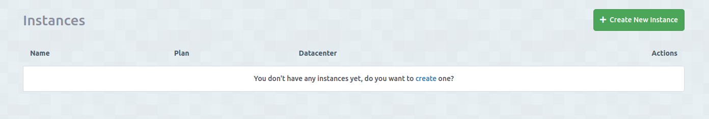
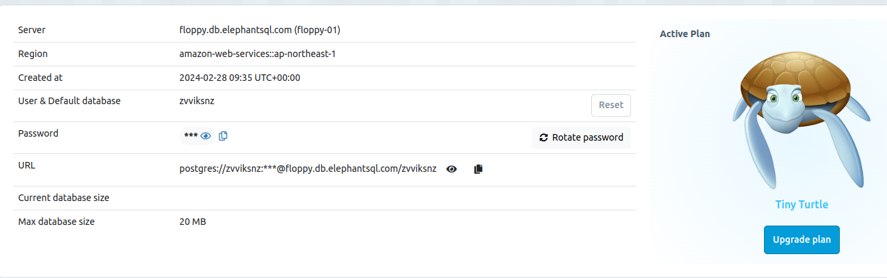

# Currency Converter Application

## Objective

Your task is to create a currency converter using the ExchangeRate-API. Documentation and necessary details can be found at [ExchangeRate-API Documentation](https://www.exchangerate-api.com/docs/standard-requests).

## Prerequisites

- Sign up for a free account at [ExchangeRate-API](https://app.exchangerate-api.com/sign-up). The free version allows for 1500 API calls per month.
- Obtain an API key for using ExchangeRate-API services. Remember to keep your API key confidential.
- Use PostgreSQL as the relational database. Sign up for a free plan (Tiny Turtle) at [ElephantSQL](https://www.elephantsql.com/plans.html).
- Create an instance by clicking on “+ Create New Instance”

- Navigate to the new Instance you created, you’ll find all information you need in order to connect you program with the database

Specifically the password and URL

- Choose your preferred programming language and framework.

## Tasks

1. You have to save all conversion rates of Omani Riyal (OMR) to all currencies every 3 minutes
For example, {“USD” : 2.6008, “QAR”: 9.8472, etc…}, meaning from 1 OMR = 2.6008 USD and so on. Make sure you save the date and timestamp for each call.
2. Create an API that retrieves all rates saved between OMR and one or more currencies, ordered by date.
3. Implement an API for converting between any two currencies, and save all conversions made by the user.
4. Develop an API that retrieves all user conversions for each currency, ordered by date.

## Notes

- This task focuses exclusively on backend development; no GUI is required.
- Use Postman or a similar tool for API testing.

## Extras

- Optionally, dockerize your application and implement basic authentication for your APIs.

## Submission

Submit your work through GitHub and email the repository link to `careers@rihal.om`. Include your name, contact information, a brief introduction, and the question you solved.
