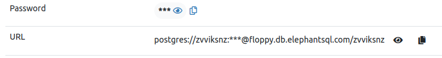

# Currency Converter Application

## Objective

Develop a cryptocurrency portfolio tracker to monitor and manage digital assets in real time. The system fetches live prices, supports portfolio creation and updates, calculates total value, and tracks performance over time.

## Prerequisites

1. **Choose a Free Cryptocurrency API**
   
To fetch real-time cryptocurrency prices, use one of the following **free APIs**:

1. **CoinGecko API** ([Docs](https://www.coingecko.com/en/api))  
   - Provides **10,000 requests per month** for free.  

2. **CoinMarketCap API** ([Docs](https://coinmarketcap.com/api/))  
   - Provides **10,000 requests per month** for free.  

    **Obtain an API key** (if required) and store it **securely**.

// **Please use free versions, don't buy credits or subscription.**

2. **Database Setup (PostgreSQL)**
   - Use **PostgreSQL** as the relational database.
   - Sign up for a free plan (Tiny Turtle) at [ElephantSQL](https://www.elephantsql.com/plans.html).
   - Create an instance by clicking on **"+ Create New Instance"**  
     
   - Navigate to your new instance to find the connection details.  
     
   - Specifically, retrieve the **database URL and password**  
     

3. Choose your preferred programming language and framework.

## Tasks

Create endpoints for the following:

1. **Fetch the List of 15 Supported Cryptocurrencies**  
   - Support only **15 specific coins**.

2. **Retrieve the Real-Time Price of a Cryptocurrency**  
   - Fetch the latest market price for any supported cryptocurrency.

3. **Allow Users to Create a Portfolio**  
   - Users should be able to **add coins** and specify the **quantity owned**.

4. **Calculate the Current Total Portfolio Value**  
   - Compute the **total value** of all assets in a user’s portfolio based on live prices.

5. **Track Portfolio Value Changes Over Time**  
   - Monitor portfolio performance by **saving snapshots** at regular intervals.

6. **Enable Users to Update Their Portfolio**  
   - Allow users to **add, remove, or modify holdings** at any time.

## Notes

- This task focuses exclusively on backend development; no GUI is required.
- Use Postman or a similar tool for API testing.

## Extras

- Optionally, dockerize your application and implement basic authentication for your APIs.

## Submission

Submit your work through GitHub and email the repository link to `careers@rihal.om`. Include your name, contact information, a brief introduction, and the question you solved.
