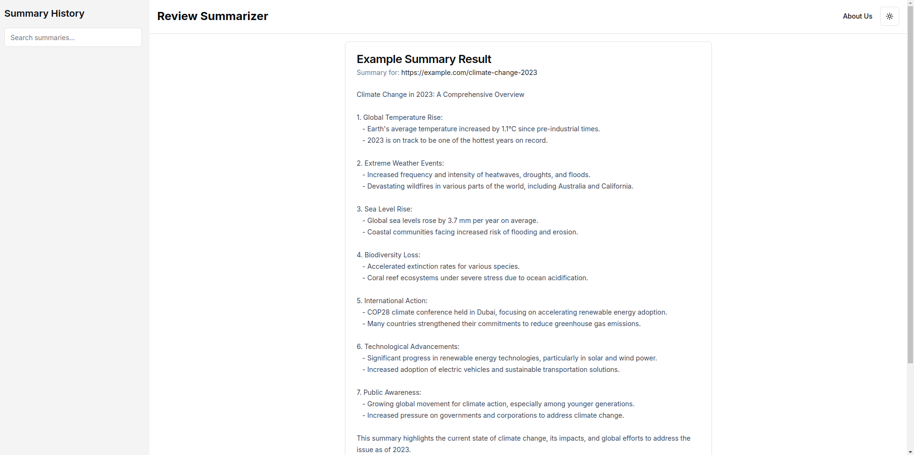

# 🚀 Product Reviews Summarizer

## 🎯 Objective

Create a web application that allows users to paste a URL of prduct reviews and receive a concise summary of the content using ai api . The application should provide a user-friendly interface, and offer additional features to enhance the user experience.

## 📌 Features & Requirements

### 🏡 URL Input and Summarization

- Allow users to input a URL
- Fetch the content from the provided URL
- Generate a concise summary of the content

### 🔍 Summary Display

- Show the generated summary in a clear, readable format
- Display the original URL
- Provide a copy-to-clipboard functionality for the summary

### 📱 Responsive Design

- Ensure the application is usable on desktop and mobile devices
- Implement a sidebar for larger screens and a collapsible menu for mobile

### 🌓 Theme Toggle

- Provide a light and dark mode option
- Allow users to switch between themes or use system preferences

### 🚨 Error Handling

- Provides user-friendly error messages for a smooth experience.

## 🎨 Current UI Design

The UI design showcases a clean and modern interface with the following key elements:

- A centered layout for the main content
- Clear and readable typography
- A minimalist color scheme with accent colors for important elements

## 🛠️ Technologies and Tools

- **Frontend Framework**: Next.js, React, Vue, Angular, or any modern framework
- **Styling**: Tailwind CSS, SCSS, or any preferred styling method
- **Animations**: CSS animations or JavaScript-based libraries (e.g., GSAP, Framer Motion)

📢 **Important Note**: You do not need to build your own API model for summarization. Please use free, publicly available APIs for this challenge.

## 🚀 Additional Enhancements

1. **Custom Summarization Options**

   - Allow users to adjust summary length
   - Implement filtering options

2. **Export Functionality**

   - Enable users to export their summary history in various formats (CSV, PDF)

3. **Multilingual Support**

   - Implement full Arabic language support, including RTL layout, translations, and proper text rendering for all UI elements and summaries

4. **Test Suite**

   - Unit tests and integration tests for critical components

## 📦 Deliverables

1. **Source Code**

   - Well-organized and commented code repository

2. **Documentation**

   - README file with setup instructions and project overview
   - API documentation for any backend services

3. **Deployment**

   - Live demo of the application deployed on a hosting platform (e.g., Vercel)

4. **Submission**
   - Submit via GitHub providing a repository link (public repository, not private) to `careers@rihal.om` with your details and the completed challenge.
