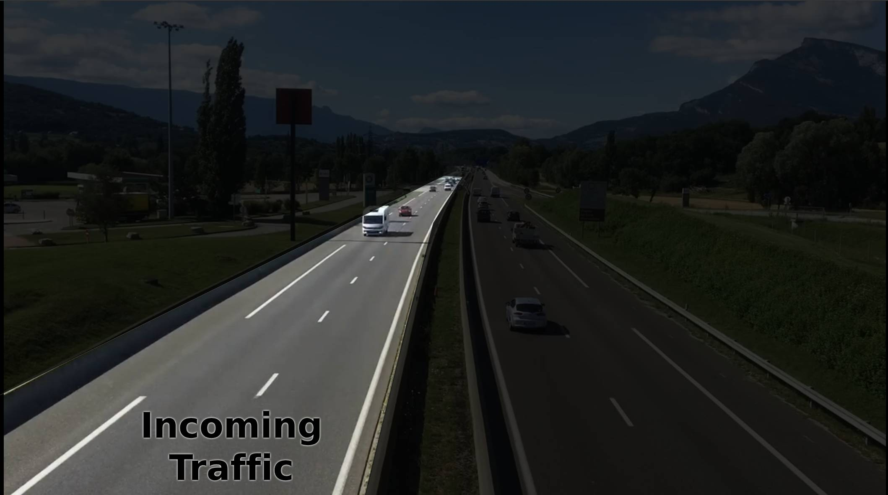

# Cars detection and counting!

## Objective

Your task is to create a car counter from a given video using [YOLO](https://github.com/ultralytics/ultralytics) pre-trained models. Then develop a [Streamlit app](https://streamlit.io/) to allow the user to upload the video to get processed, after that, the processed video should be displayed to the user.

## Tasks

Develop a streamlit app that can does the following:
1. Accepts video file upload as an input ([Use this file](cars.mp4))
2. Uses any YOLO pre-trained model to detect the cars moving in the video
3. Draws bounding boxes on the cars, and annotate each box with the object name (e.g. "Car" "Truck", "Motorbike")
4. Extra: Count the cars only in the incoming lane (check image below)
5. Extra: Keep separate count for cars, trucks, motorbikes...

## Notes

- Include the processed video in your submission (the cars video with annotations, boxes and cars counted)
- Include `requirements.txt` file or any equivalent file to set the project dependencies requirement

## Submission

Submit your work through GitHub and email the repository link to `careers@rihal.com`. Include your name, contact information, a brief introduction, and the question you solved.
Also upload video recording of the project running successfully.
