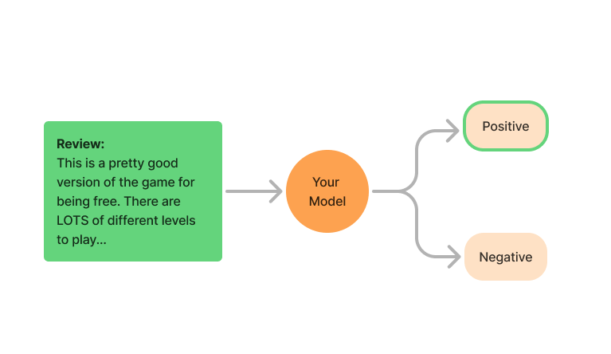
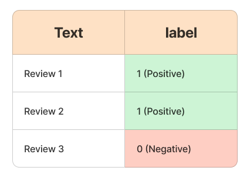

# Sentiment Analysis Challenge

## Overview
Build a model to classify Amazon reviews as positive or negative. The dataset has 19,396 reviews with:
- **text**: review content
- **label**: sentiment (0 for negative, 1 for positive)

  

## Instructions

1. **Starter Notebook**  
   Begin with [`challenge_starter_template.ipynb`](challenge_starter_template.ipynb).

2. **Project Tasks**
   - **EDA:**  
     Check for missing values, distributions, duplicates, and review lengths. Visualize your findings.
   - **Preprocessing:**  
     Clean text (remove punctuation/stopwords, tokenize, lemmatize), convert to numerical features (e.g., TF-IDF), encode labels, and split data (use `random_state=42`).
   - **Model Building:**  
     Implement your sentiment classifier (using ML or deep learning methods).
   - **Evaluation:**  
     Report the F1 score and compare training vs. validation performance.
   - **Inferencing (Optional):**  
     Test your model on unseen data.

## Getting Started
- Set up your environment as described in the starter notebook.
- Open `challenge_starter_template.ipynb` and follow the tasks.

## Submission

Submit your work through GitHub and email the repository link to `careers@rihal.om`. Include your name, contact information, a brief introduction, and the question you solved.
Also upload video recording of the project running successfully.

